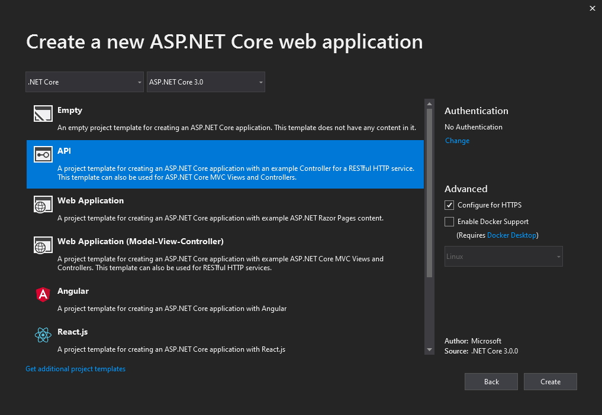
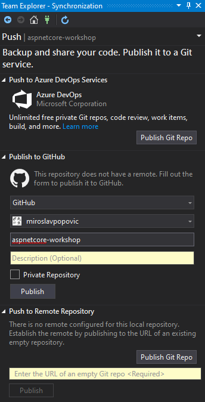
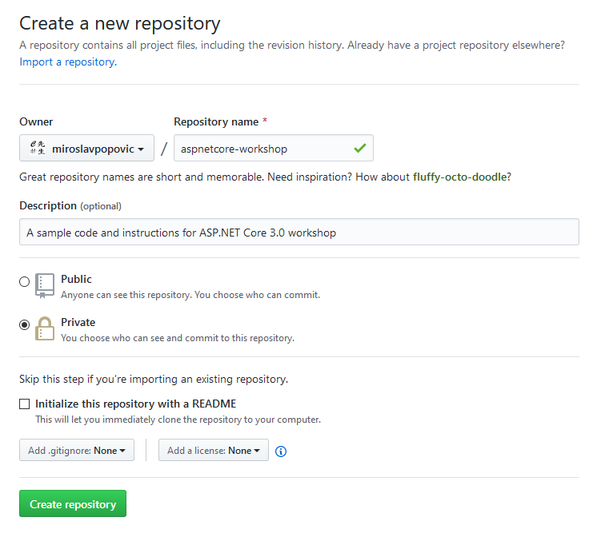
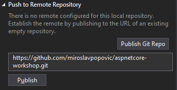
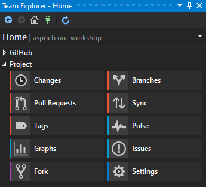
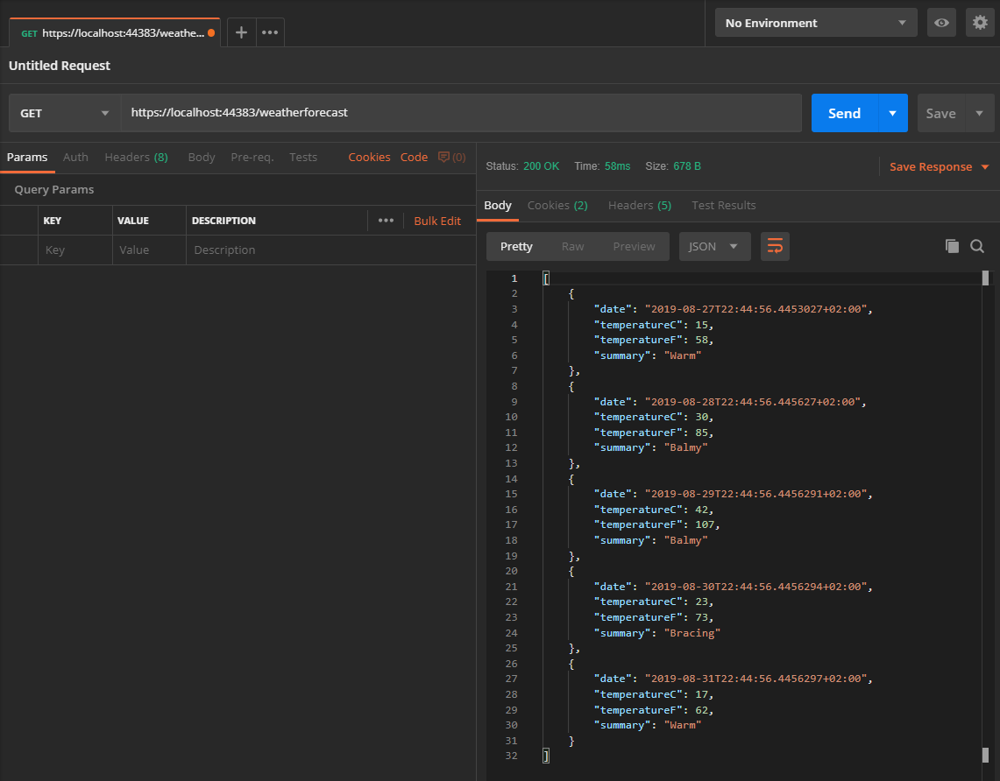

# Project initialization

From this part on, it's assumed that we have chose the following:
- Time tracker as the domain - see [previous part](03-choosing-a-domain.md)
- ASP.NET Core Web API application template as a base
- Visual Studio 2019 as the IDE of choice
- Git tools integrated in Visual Studio

In this part, we'll initialize our project, configure the git repository, connect it with GitHub and see how to use Postman to test our API. But first, we'll have a brief introduction to REST APIs.

## REST API introduction

This introduction is done in form of PowerPoint presentation. It explains what REST API is, the steps necessary to make production-ready API and how ASP.NET Core can help us with that. You can download the presentation [here](rest-api-introduction.pptx).

## Creating a project

Create a new ASP.NET Core Web Application project in Visual Studio 2019, name it *TimeTracker*, and finally select API as a template:

### Optional step

This step is optional, but it's a good practice to tidy up your source code repository. For git repositories, it's a convention to have `src` folder in your root to hold all source code. Let's modify our folder structure in order to do so. You'll need to close the Visual Studio in order to make the changes. This is how your folders should look like after the change:

- `aspnetcore-workshop` - this is the root folder in my case, your root folder name might differ
    - `src` - folder containing all the projects, for now we have only one API project
        - `TimeTracker` - folder for TimeTracker API project
            - `TimeTracker.csproj` and other files and folders
- `TimeTracker.sln` - solution file

You can check the structure in this GitHub repository. There will be other folders next to `src`, like `test`, `doc`, etc.

Now that the folder structure is created, let's modify `TimeTracker.sln` file to point to a new location of `TimeTracker.csproj` file. Modify the line that looks like this:

    Project("{FAE04EC0-301F-11D3-BF4B-00C04F79EFBC}") = "TimeTracker", "TimeTracker\TimeTracker.csproj", "{6B239834-5A44-48A7-A80A-1DC9BA1B6A88}"

Into this:

    Project("{FAE04EC0-301F-11D3-BF4B-00C04F79EFBC}") = "TimeTracker", "src\TimeTracker\TimeTracker.csproj", "{6B239834-5A44-48A7-A80A-1DC9BA1B6A88}"

Open the solution file in Visual Studio to continue working on it.

## Configuring git

In the bottom right corner of Visual Studio IDE, you should see *Add to Source Control* button. When you click it, select Git from the list (assuming you have git support installed).

This will initialize a git repository for your solution. A hidden `.git` folder will be added to your root folder, as well as default `.gitattributes` and `.gitignore` files. It will also create an initial commit out of your source code. Next step will be to connect your repository to a remote one on GitHub. Visual Studio will automatically open Team Explorer Synchronization pane:

Depending on whether you have GitHub extension installed, you'll also have the create the repository on GitHub and publish to it directly. *Push to Remote Repository* should be used if no GitHub extension is installed, so let's use that this time.

Go to your GitHub account and create a [new repository](https://github.com/new):

In the screenshot above, the repository name is `aspnetcore-workshop`, but you can name it as you like. Description should be provided also, especially if the repository is a public one. 

You can choose to create private repository, if you don't want anyone to see it (you can share with up to 3 people for free). As a suggestion, make as many things as you can public and accessible to others. We can learn a lot by sharing code and reading other people's code. That's the beauty of open-source.

Don't enable `README` file, `.gitignore` and license file, as it would create an initial commit to GitHub repository. We need to import an existing one instead.

Note: It's a good practice to always include license with your code so make sure you add one later. It's usually created by adding `LICENSE` file to the root of your repository. E.g. for hobby projects, MIT license is a good choice, as it's one of the least restrictive ones. There's also [a site](https://choosealicense.com/) that can help you pick the correct license.

After you click *Create repository*, GitHub will give you instructions on how to setup or import your repository.

Copy the HTTPS URL and paste it into Visual Studio's Team Explorer Synchronization panel and click *Publish*.

After the publishing is done, you'll be able to browse your code on GitHub and Visual Studio will show you the Home pane of Team Explorer. Get familiar with it, as this is how you will do git operations - push, pull, commit, merge, etc.

Now it's a good time to add some files to the root folder - `README.md` and `LICENSE`. Take a look at the root of [this repository](https://github.com/miroslavpopovic/aspnetcore-workshop) for the samples. Do a `git commit` and `git push` afterwards. From this point on, we won't mention git commands unless it's not required. Commit and push your code at your own pace, preferrably often.

## Running the application

By default, Visual Studio will configure your application to run under IIS Express web server, with a specific port. You can press `F5` or click on `▶️ IIS Express` button in the toolbar to run the server and browse your application.

Your browser might give you a warning about potential security risk. That's because HTTPS is used by default, and IIS Express is using self-signed certificate for local development. Browsers do not like self-signed certificates, hence the warning. You can ignore it and proceed (Accept the risk and continue).

API template comes with `ValuesController` that serves as a sample for API. When you run the app, the browser will go to `https://localhost:port/api/values` (where port is your port number) and return JSON `["value1","value2"]`. This is what we expect, but browsers aren't really good when trying APIs, since we also need to have the ability to easily create `GET`, `POST`, `PUT` and `DELETE` methods, define parameters, etc. For that purpose, other tools should be used. Enters Postman.

## Using Postman

[Postman](https://www.getpostman.com/) is a tool for managing APIs. We can also use it to quick test if everything is working correctly with our API.

Run Postman and create a new GET request. Enter `https://localhost:port/api/values` as URL and click *Send*. You should get HTTP status code 200 in response, with JSON payload.

Postman allows you to create collections to organize your API calls. E.g. you could create a collection for your API, and have different request for each endpoint. Collections can be exported and shared. You can find the exported Postman collection for the sample API in the root of this repository.

We'll be using Postman throughout this workshop. To learn more about Postman, check it's excellent [documentation](https://learning.getpostman.com/).

-------

Next: [Domain models and database](05-domain-models-and-database.md)