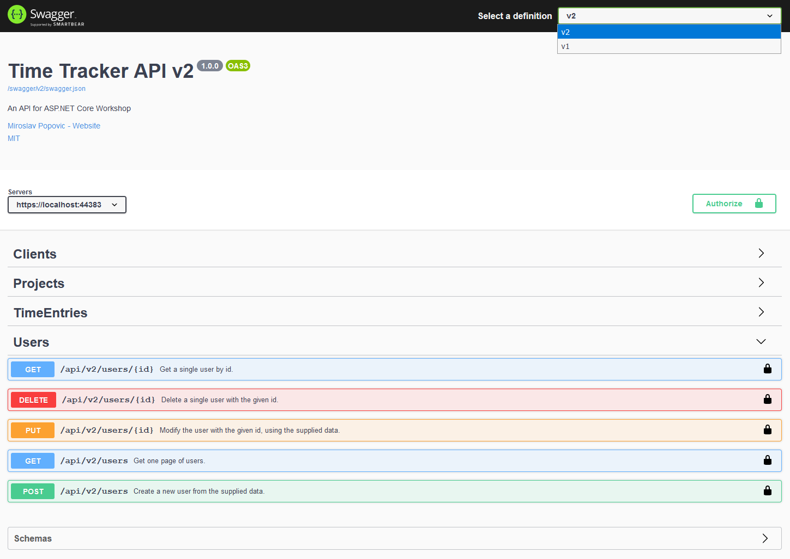
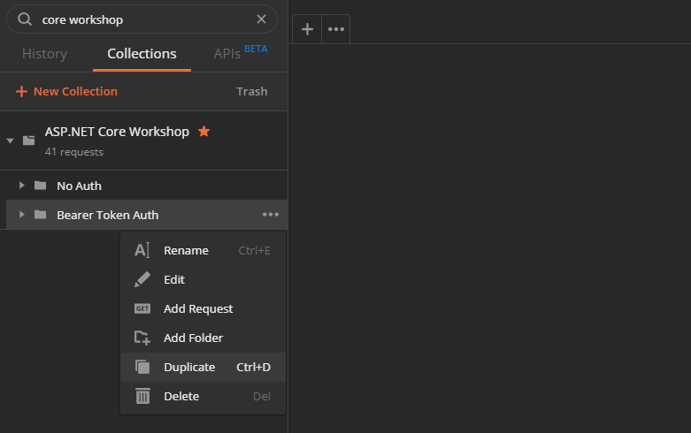
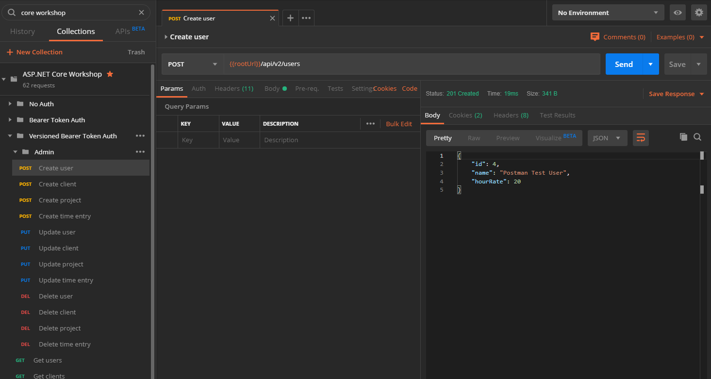

# Versioning, usage limiting, logging and monitoring

In this part, we'll cover few more things that helps us tighten up our APIs.

## Versioning

Whenever we make a change in our API, that would break some existing API client, we need to introduce a new version. Old versions still need to function, until all API clients switch to the newer one. There are various strategies for implementing API versioning:
- URL
    - /api/v2/games/
- Query string
    - /api/games?api-version=2
- Custom request header
    - api-version: 2
- Accept header
    - Accept: application/json;v=2

There's a NuGet package that supports all of those strategies: `Microsoft.AspNetCore.Mvc.Versioning`. We need to install it first. The version that included support for ASP.NET Core 3.0 is 4.0.0. It's still in preview at the time of writing, so don't forget to check *Include prerelease* when installing it via NuGet Package Manager. Also install prerelease of `Microsoft.AspNetCore.Mvc.Versioning.ApiExplorer`.

We are going to use URL strategy, the first one in the list above. To simulate a new API version, we'll add `Controllers\V1` folder, add a copy of our current controllers (for clients, projects, users and time entries) there and change their namespace to include `V1`. Routes on those controllers will also be changed as well as new `ApiVersion` attribute added. Here's the sample for `UsersController`:

```c#
namespace TimeTracker.Controllers.V1
{
    [ApiController]
    [ApiVersion("1", Deprecated = true)]
    [Authorize]
    [Route("/api/v{version:apiVersion}/users")]
    public class UsersController : Controller
    {
        // ...
    }
```

Modify other V1 controllers too. You usually want to support older clients and give your users time to switch to new version of API, hence you need to keep older versions too, at least for some time.

Now let's modify the original controllers that are left in `Controllers` namespace. They will be our current version and we'll mark them as version `V2`. For example, this is how `UsersController` will look like:

```c#
namespace TimeTracker.Controllers
{
    [ApiController]
    [ApiVersion("2")]
    [Authorize]
    [Route("/api/v{version:apiVersion}/users")]
    public class UsersController : Controller
    {
        // ...
    }
```

Modify other V2 controllers too.

Also, in all V1 and V2 controllers, look for `CreatedAtAction`. Since we have added a new route parameter for API version, we need to supply it too when calling `CreatedAtAction`. I.e. like this:

    return CreatedAtAction(nameof(GetById), "users", new {id = user.Id, version = "1"}, resultModel);

For V1 controllers use `version = "1"` and for V2 controllers use `version = "2"`. Without it, the server would break on `POST` methods stating that the correct address cannot be found.

Next step, we need to configure versioning services. We'll do that in an extension method, defined in our `ServiceCollectionExtensions` class:

```c#
public static void AddVersioning(this IServiceCollection services)
{
    services.AddApiVersioning(
        options =>
        {
            options.AssumeDefaultVersionWhenUnspecified = true;
            options.ReportApiVersions = true;
            options.ApiVersionReader = new UrlSegmentApiVersionReader();
        });
    services.AddVersionedApiExplorer(
        options =>
        {
            options.GroupNameFormat = "'v'VVV";
            options.SubstitutionFormat = "VVV";
            options.SubstituteApiVersionInUrl = true;
            options.ApiVersionParameterSource = new UrlSegmentApiVersionReader();
        });
}
```

While there, let's also refactor our `AddOpenApi` method to support versioning. Luckily, NSwag works OK with MVC Versioning. We'll move our document initialization code into a separate private method, and call it twice from `AddOpenApi` since we need to create two swagger documents - one for each version of the API. This is our new document initialization method:

```c#
private static void InitializeOpenApiDocumentOptions(
    AspNetCoreOpenApiDocumentGeneratorSettings options, string version)
{
    options.DocumentName = version;
    options.Title = $"Time Tracker API {version}";
    options.ApiGroupNames = new[] {version};

    options.Description = "An API for ASP.NET Core Workshop";
    options.IgnoreObsoleteProperties = true;

    options.OperationProcessors.Add(
        new OperationSecurityScopeProcessor("jwt-token"));
    options.DocumentProcessors.Add(
        new SecurityDefinitionAppender(
            "jwt-token", new[] {""}, new OpenApiSecurityScheme
            {
                Type = OpenApiSecuritySchemeType.ApiKey,
                Name = "Authorization",
                Description =
                    "Enter \"Bearer jwt-token\" as value. " +
                    "Use https://localhost:44383/get-token to get read-only JWT token. " +
                    "Use https://localhost:44383/get-token?admin=true to get admin (read-write) JWT token.",
                In = OpenApiSecurityApiKeyLocation.Header
            }));

    options.PostProcess = document =>
    {
        document.Info.Contact = new OpenApiContact
        {
            Name = "Miroslav Popovic",
            Email = string.Empty,
            Url = "https://miroslavpopovic.com"
        };
        document.Info.License = new OpenApiLicense
        {
            Name = "MIT",
            Url = "https://opensource.org/licenses/MIT"
        };
    };
}
```

Now we need to modify the `AddOpenApi` method to call it twice for both versions:

```c#
public static void AddOpenApi(this IServiceCollection services)
{
    services
        .AddOpenApiDocument(
            options => InitializeOpenApiDocumentOptions(options, "v2"))
        .AddOpenApiDocument(
            options => InitializeOpenApiDocumentOptions(options, "v1"));
}
```

Finally, let's register `AddVersioning` from `Startup.ConfigureServices`. Add this line just below `services.AddControllers` line:

    services.AddVersioning();

If you run your application now and go to `/swagger` in your browsers, you'll see that both V1 and V2 are available.



Great! Let's now modify Postman collection in order to access the versioned API. We'll duplicate the existing *Bearer Token Auth* folder and rename it to *Versioned Bearer Token Auth*:



Unfortunately, we haven't define `/api/` in our `{{rootUrl}}` variable in Postman, so we need to modify the URL of each request under *Versioned Bearer Token Auth* folder to include `/api/v2/`. I.e. `{{rootUrl}}/api/users` will become `{{rootUrl}}/api/v2/users`.



One more thing to fix. Our integration tests in `UserApiTests` (and other API tests if you have implemented them) were targeting `/api/users`. We need to modify each occurrence to use `/api/v2/users` prefix.

That's it! Our API is now properly versioned.

## Usage limiting

If your API has many API clients, sooner or later, one of them will try to abuse it, intentionally or unintentionally. One way to abuse the API would be to create a big number of requests in a short period of time.

To prevent that, we can implement usage limiting per token. Let's implement a simple middleware that will save the last access time for each token and save it to in-memory dictionary.

```c#
public class LimitingMiddleware
{
    private static readonly IDictionary<string, DateTime> TokenAccess = new Dictionary<string, DateTime>();

    private readonly RequestDelegate _next;
    private readonly ILogger<LimitingMiddleware> _logger;

    public LimitingMiddleware(RequestDelegate next, ILogger<LimitingMiddleware> logger)
    {
        _next = next;
        _logger = logger;
    }

    public async Task Invoke(HttpContext context)
    {
        var request = context.Request;
        var path = request.Path.HasValue ? request.Path.Value : string.Empty;

        if (path.ToLowerInvariant().Contains("/api/"))
        {
            var token = request
                .Headers["Authorization"]
                .FirstOrDefault()?
                .ToLowerInvariant()
                .Replace("bearer ", "");

            if (token != null)
            {
                if (!TokenAccess.ContainsKey(token))
                    TokenAccess.Add(token, DateTime.UtcNow);
                else
                {
                    var lastAccess = TokenAccess[token];
                    TokenAccess[token] = DateTime.UtcNow;

                    if (lastAccess.AddSeconds(5) >= DateTime.UtcNow)
                    {
                        const string message = "Token limit reached, operation cancelled";

                        _logger.LogInformation(message);

                        var problem = new ProblemDetails
                        {
                            Type = "https://yourdomain.com/errors/limit-reached",
                            Title = "Limit reached",
                            Detail = message,
                            Instance = "",
                            Status = StatusCodes.Status429TooManyRequests
                        };

                        var result = JsonConvert.SerializeObject(
                            problem,
                            new JsonSerializerSettings
                            {
                                ContractResolver = new CamelCasePropertyNamesContractResolver()
                            });

                        context.Response.StatusCode = StatusCodes.Status429TooManyRequests;
                        context.Response.ContentType = "application/json";

                        await context.Response.WriteAsync(result);

                        return;
                    }
                }
            }
        }

        await _next(context);
    }
}
```

We won't get into the details of the implementation. Just know that it will work on API URLs to check when the current token used for the request has accessed the API last time. If the time is under 5 seconds, an HTTP `409 Too Many Requests` response is returned.

To enable this middleware, you need to add the line to `Startup` class' `Configure` method, just after the `ErrorHandlingMiddlewareLine`:

```c#
app.UseMiddleware<ErrorHandlingMiddleware>();
app.UseMiddleware<LimitingMiddleware>();
```

Now you can test the behavior using Postman.


Note that the implementation above will not work correctly in distributed scenarios - when you have multiple instances of your API. Reason - we are using in-memory dictionary. It will be in a memory of the machine that's processing the request. All other machine won't have a copy. For that case, take a look at [ASP.NET Core caching](https://docs.microsoft.com/en-us/aspnet/core/performance/caching/response?view=aspnetcore-3.0#other-caching-technology-in-aspnet-core).

## Logging and monitoring

Once your application is up and running, you need to somehow track its behavior in order to keep it healthy. There are a number of ways to do that. The most simple one would be to periodically look into application logs for any signs of unexpected behavior - or you could automate that with tools for log analysis.

### Logging

Thanks to libraries like NLog, Serilog and similar, we can define log output to go to file, database, some third party service, tools like Elasticsearch, etc. They have NuGet packages for integration with ASP.NET Core logging. For now, let's add [Serilog](https://github.com/serilog/serilog-aspnetcore) and enable logging to a file. Install the `Serilog.AspNetCore` and `Serilog.Sinks.File` (pre-release) NuGet packages.

Modify your `Program` class to look like this:

```c#
public class Program
{
    public static int Main(string[] args)
    {
        Log.Logger = new LoggerConfiguration()
            .MinimumLevel.Debug()
            .MinimumLevel.Override("Microsoft", LogEventLevel.Information)
            .Enrich.FromLogContext()
            .WriteTo.File(
                "./logs/time-tracker.log",
                fileSizeLimitBytes: 1_000_000,
                rollOnFileSizeLimit: true,
                shared: true,
                flushToDiskInterval:TimeSpan.FromSeconds(1))
            .CreateLogger();

        try
        {
            Log.Information("Starting web host");
            CreateHostBuilder(args).Build().Run();
            return 0;
        }
        catch (Exception ex)
        {
            Log.Fatal(ex, "Host terminated unexpectedly");
            return 1;
        }
        finally
        {
            Log.CloseAndFlush();
        }
    }

    public static IHostBuilder CreateHostBuilder(string[] args) =>
        Host.CreateDefaultBuilder(args)
            .ConfigureWebHostDefaults(webBuilder =>
            {
                webBuilder.UseStartup<Startup>();
            })
            .UseSerilog();
}
```

That's it. Serilog will now be used each time you log something using ASP.NET Core's `ILogger` and `ILogger<T>` interfaces. It is also configured to catch any unexpected exception while starting a host and log it as fatal error. All logs will go to `./logs/time-tracker.log` file. If you run the application now and make few requests, you'll see that the file is created and filled in with log entries.

You can configure multiple log outputs (called sinks in Serilog). For a list of available sinks, take a look at [Serilog wiki](https://github.com/serilog/serilog/wiki/Provided-Sinks).

### Health checks

ASP.NET Core has a notion of health checks. To understand what they are, you can look at status dashboards of popular services like [Azure](https://status.azure.com/en-us/status), [Google Cloud](https://status.cloud.google.com/), [Facebook](https://developers.facebook.com/status/dashboard/), [Twitter](https://api.twitterstat.us/), [Dropbox](https://status.dropbox.com/)... Basically, a number of different health checks are participating in forming the overall status image of the service.

Health checks can be a simple ping responses that just return HTTP `200 OK` when called, to indicate that the server is live, or they can do complex queries and requests themselves to form a response containing more in-depth information.

Health checks are also especially useful in containerized scenarios. Container tools like Docker can use health checks to decide whether the service in container is running or not, and perform decisions like whether to restart the container, based on the response.

To use health checks, you need to add all the services that health checks require. Add the following like to your `Startup.ConfigureServices` method:

```c#
services.AddHealthChecks();
```

Adding ping health check is simple. Just modify the `app.UseEndpoints`  call in your `Startup.Configure` method to look like this:

```c#
app.UseEndpoints(endpoints =>
{
    endpoints.MapControllers();
    endpoints.MapHealthChecks("/health");
});
```

If you run your application now and navigate to `/health` endpoint, you should get *Healthy* as a response. Even this simple check can help with Docker containers, for instance.

Health checks can also be used to validate the database status. There's an open-source project called [`AspNetCore.Diagnostics.HealthChecks`](https://github.com/Xabaril/AspNetCore.Diagnostics.HealthChecks) that contains a number of different health checks, SQLite db check among others. Let's install the package with SQLite check `AspNetCore.HealthChecks.Sqlite`.

Modify `Startup.ConfigureServices` method to include the new health check too:

```c#
services.AddHealthChecks()
    .AddSqlite(Configuration.GetConnectionString("DefaultConnection"));
```

If you run the application, and browse `/health` the response should again be *Healthy*, even though we have a new health check. If all health checks are passed, the response will be *Healthy* by default.

If we modify the `AddSqlite` call like this, it will return *Unhealthy*, since there is no table named *something* in the database:

```c#
services.AddHealthChecks()
    .AddSqlite(Configuration.GetConnectionString("DefaultConnection"), "select name from something");
```

This proves that SQLite health check works. Remove the SQL query from the method call above.

You can also create your own custom health checks, by implementing `IHealthCheck` interface and registering the health check class. As a sample, look into the source code of [`SqliteHealthCheck` on GitHub](https://github.com/Xabaril/AspNetCore.Diagnostics.HealthChecks/blob/master/src/HealthChecks.Sqlite/SqliteHealthCheck.cs).

Wouldn't it be nice to have a status page like Azure, Facebook and other services? There's a way to add it without much effort via `AspNetCore.HealthChecks.UI` NuGet package, which is also a part of `AspNetCore.Diagnostic.HealthChecks` project. Install that package and modify the `Startup` class as follows:

```c#
// At the end of ConfigureServices method:
services.AddHealthChecksUI();
```

*NOTE: Unfortunately, the line above is causing issue with .NET Core Preview 7. It's related to Entity Framework Core (again) and the underlined Sqlite database used for saving health checks. You can read the rest of this section, but won't be able to implement it yet if using Preview 7.*

```c#
// Modify app.UseEndpoints, and add UI middleware before it:
app.UseHealthChecksUI();

app.UseEndpoints(endpoints =>
{
    endpoints.MapControllers();
    endpoints.MapHealthChecks("/health", new HealthCheckOptions
    {
        Predicate = _ => true,
        ResponseWriter = UIResponseWriter.WriteHealthCheckUIResponse
    });
});
```

Also, add the following settings to `appsettings.json` file:

```json
"HealthChecksUI": {
"HealthChecks": [
    {
    "Name": "HTTP-Api-Basic",
    "Uri": "/health"
    }
],
"EvaluationTimeOnSeconds": 10,
"MinimumSecondsBetweenFailureNotifications": 60
}
```

If you browse `/healthchecks-ui` now, you'll get the status page.


*TODO: Unfortunately, `AspNetCore.HealthChecks.UI` is using EF Core under the cover, and it's more or less broken in Preview 6-8, hence the error message in screenshot above.*

### Other monitoring types

There are other things you can monitor in your database. For instance, doing performance tracking to see if your application is having some performance issues. Also, usage tracking - e.g. to track which token is using which resource and how often.

If you are using Azure cloud, it has a number of services ready for monitoring, like Azure Monitor, Application Insights, Log Analytics, etc.

There are also third party monitoring services like:
- https://newrelic.com/
- https://stackify.com/
- https://www.monitis.com/
- https://www.runscope.com/
- ...

With this part, we have completed the API features. In the next part, we'll investigate how to consume our API from client-side Blazor.

-------

Next: [Blazor client](10-blazor-client.md)
